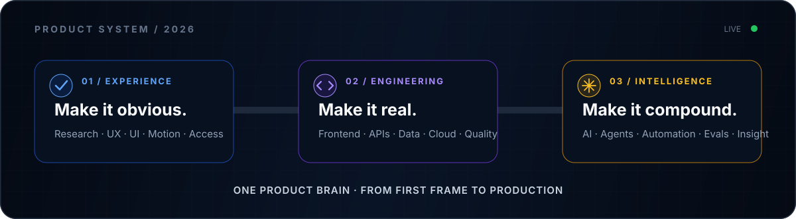

<!--
  GitHub Profile README for github.com/jafferkimitei
  Built as a product page: clear positioning, proof, personality, and conversion.
-->

<p align="center">
  
</p>

<h1 align="center">Jaffer Kimitei</h1>

<p align="center">
  <strong>UX Engineer who ships the whole product.</strong>
</p>

<p align="center">
  I turn ambiguous ideas into intuitive interfaces, resilient full-stack systems, and useful AI.<br />
  Nairobi, Kenya · Building globally
</p>

<p align="center">
  <a href="https://jafferkimitei.com"></a>
  <a href="https://jafferkimitei.com/work"></a>
  <a href="mailto:hello@jafferkimitei.com"></a>
</p>

---

### I work where design intent meets production reality

I map the journey in Figma, engineer the interface in React and Next.js, build the APIs and data layer behind it, then integrate intelligence where it creates real leverage. The result is not just a polished screen or a working endpoint—it is a coherent product system.

| `01 / EXPERIENCE` | `02 / ENGINEERING` | `03 / INTELLIGENCE` |
| --- | --- | --- |
| User journeys & interaction design<br />Design systems & prototyping<br />Motion, accessibility & performance | TypeScript product architecture<br />Frontend, APIs & databases<br />Testing, cloud & delivery | LLM product integration<br />Agentic workflows & automation<br />Extraction, evaluation & analytics |

<p align="center">
  
</p>

| Product | What it proves | Explore |
| --- | --- | --- |
| **Eycube** | Design-led software, SaaS, automation, and AI systems built for scale | [Live studio ↗](https://eycube.com) |
| **EyTicket** | Real-time ticketing infrastructure with payments, analytics, and QR validation | [Live product ↗](https://eyticket.live) |
| **Selected Work** | Production websites and product experiences across multiple industries | [View portfolio ↗](https://jafferkimitei.com/work) |

### The toolkit

<p align="center">
  
</p>

```text
DESIGN       Figma · Prototyping · Design Systems · Motion · WCAG
FRONTEND     TypeScript · React · Next.js · Vue · Tailwind · Zustand · TanStack Query
BACKEND      Node.js · NestJS · FastAPI · REST · GraphQL · PostgreSQL · MongoDB · Redis
AI           LLM Integration · Structured Extraction · Agent Workflows · Evals · Automation
DELIVERY     Docker · GitHub Actions · AWS · Vercel · Testing · Performance Engineering
```

### Build philosophy

> **Design should feel inevitable. Technology should disappear. Systems should scale silently.**

I care about the details users feel but rarely name: hierarchy, latency, feedback, motion, edge cases, accessibility, and the moment a complex workflow suddenly feels obvious.

<details>
  <summary><strong>Beyond the interface</strong></summary>
  <br />
  I also work in film, photography, and visual storytelling. That creative discipline shapes how I use composition, rhythm, motion, and narrative inside digital products.
</details>

### GitHub signal

<p align="center">
  
  
</p>

<p align="center">
  
</p>

### Support the work ☕

If something I designed, built, photographed, or shared helped you—or simply made you think differently—you can help fuel the next build.

<p align="center">
  <a href="https://ko-fi.com/jafferkimitei">
    
  </a>
</p>

<p align="center">
  <sub>Every coffee supports new product experiments, open-source work, photography, and visual stories.</sub>
</p>

---

<h3 align="center">Have a hard product problem?</h3>

<p align="center">
  If it needs equal respect for the user journey, the architecture, and intelligent automation,<br />
  that is exactly my kind of work.
</p>

<p align="center">
  <a href="https://www.linkedin.com/in/jafferkimitei"></a>
  <a href="https://medium.com/@jafferkimitei"></a>
  <a href="https://x.com/jafferkimitei"></a>
  <a href="mailto:hello@jafferkimitei.com"></a>
</p>

<p align="center">
  
</p>

